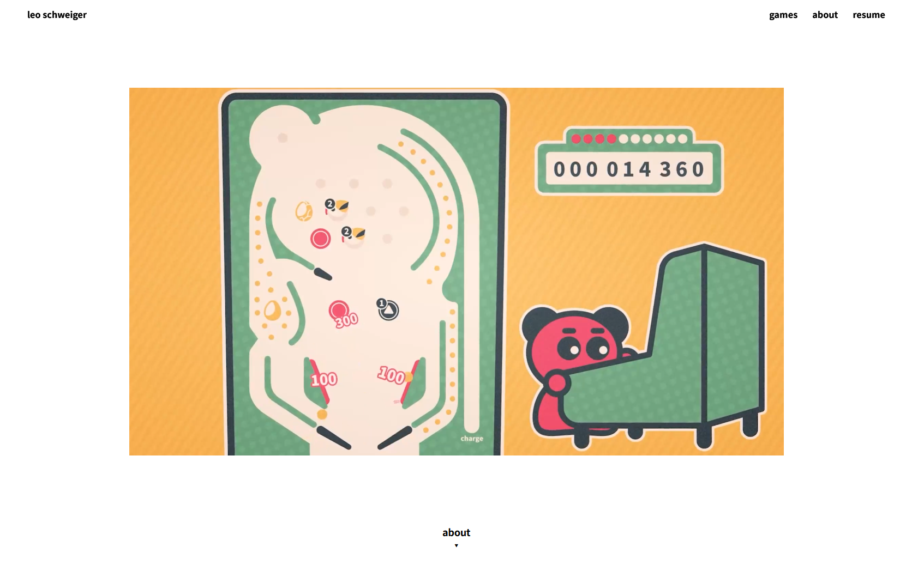

# leoschweiger.com

Source code for my personal portfolio website:  
👉 https://leoschweiger.com

This repository exists mainly for transparency. I like having some public code on GitHub, and this project is a good representation of how I approach web development and design, even though my main focus is game development.

## About

I’m not a full-time web developer, but I care about:
- clean structure
- modern tooling
- visual polish
- not relying on website builders

The site is intentionally simple and fast. It’s meant to showcase my work, not to be a complex web app.

## Tech

* Framework: [Astro](https://astro.build/)
* Package Manager: [npm](https://www.npmjs.com/)
* Deployment: [Cloudflare Pages](https://pages.cloudflare.com/)

Before this, I used a PHP-based setup. It worked, but hosting was slower and more expensive than it needed to be. Switching to Astro + static hosting made the site faster, cheaper, and easier to maintain.

## Resume generation

My resume PDF is generated automatically using [Puppeteer](https://pptr.dev/).

👉 [resume-leo-schweiger.pdf](https://leoschweiger.com/resume-leo-schweiger.pdf)

The content comes directly from the [/about](https://leoschweiger.com/about) page. This way, the website and the PDF always stay in sync, and I don’t have to maintain the same information twice.

## Notes

No contributions, issues, or pull requests intended
