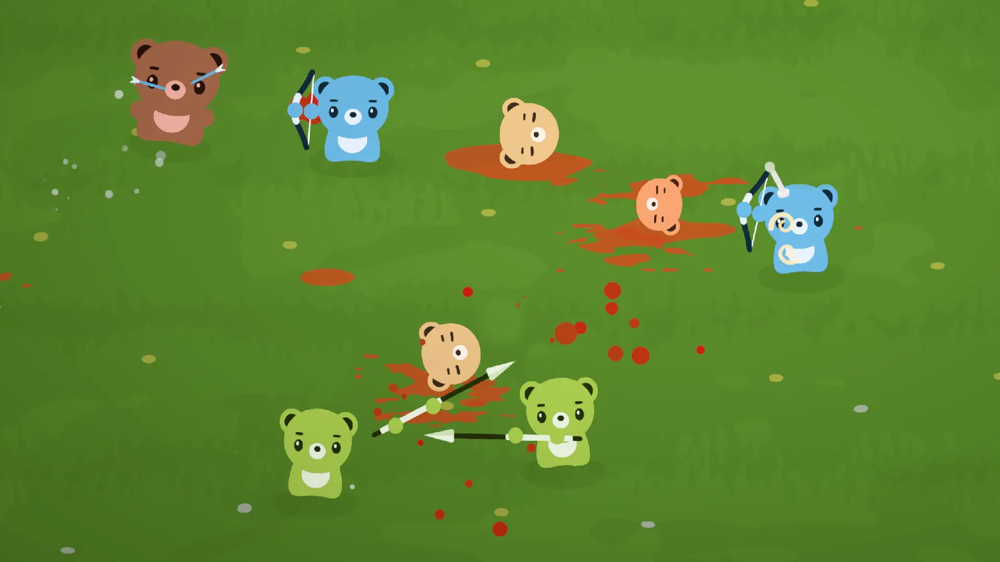
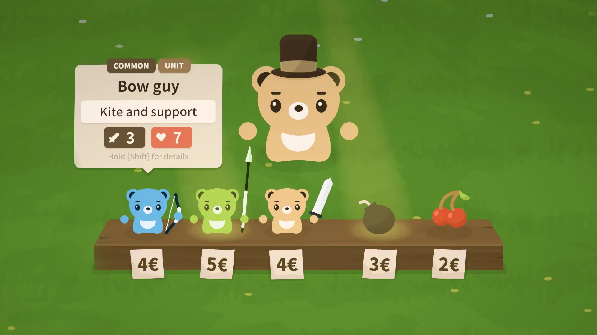

---

### overview
Developed as part of a multimedia project at Salzburg University of Applied Sciences with [David Zandanell](https://portfolio.fh-salzburg.ac.at/users/david-thomas-zandanell). Game logic, networking, art, and concept were handled by us, while music and sound were provided by [Sebi Schweiger](https://www.schweigersebi.com/), [Andreas Steiner](https://www.instagram.com/tom.joseph.official/) and [Saida Feitl](https://www.instagram.com/saidaftl).

### what i did
I implemented the unit battle logic and physics interactions in Unity using C#, and built the asynchronous multiplayer systems along with content pipelines for units, items, and modifiers. I also created all the art assets and animations.

### results
Over 2000 matches were played in the first week. We also showcased the game at the [Level Up Salzburg](https://www.levelup-salzburg.at/) and the [A1 Esports Festival Vienna](https://www.a1esports.at/festival/). We presented it to visitors and received positive feedback from players and developers alike.
