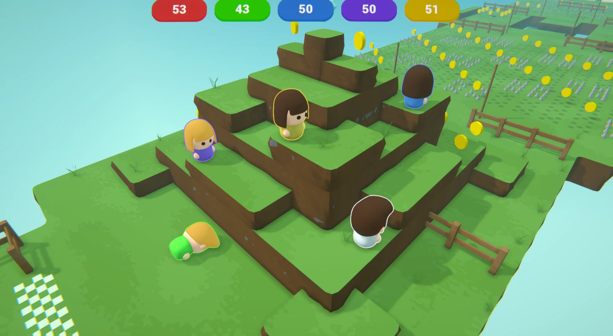
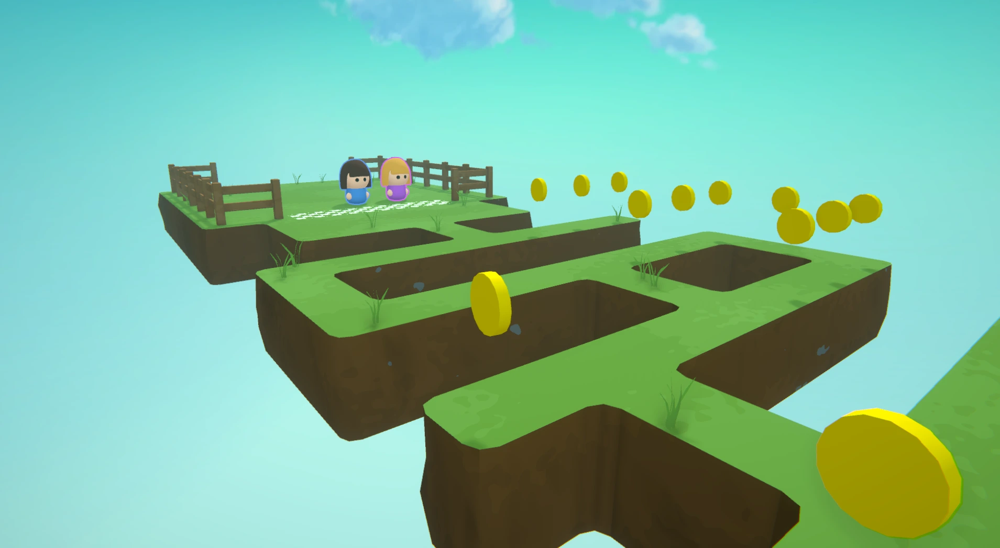
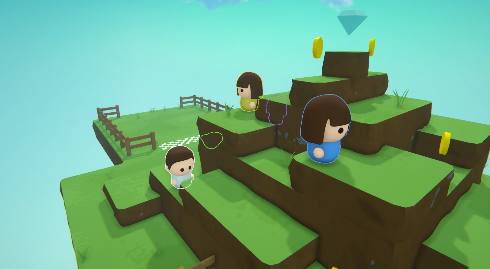

---

### overview
This concept game was created entirely by me in the Unity Game Engine. It was a project aimed at utilizing the 3D features of the engine and building scalable systems to create map parts, power-ups, and special obstacles.

### goals
The main goals were to learn about Unity's 3D features, create my own tile maps and 3D models, and craft a unique and visually pleasing art style, all while making a fun game to play with my friends.

### learnings
Being my first bigger project, I learned a lot from my mistakes. Prioritizing quick prototypes instead of obsessing over details was my key takeaway. Although I was happy with the result, my approach to game development changed significantly after completing this project.

### reception
While the game's art style was appealing and appreciated, the game would have benefited from more user testing in the early stages of development. This was a key lesson I took into future projects.
