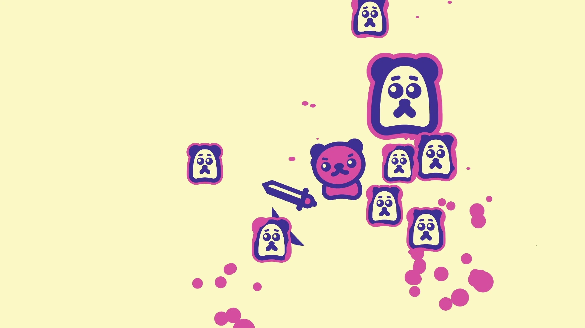
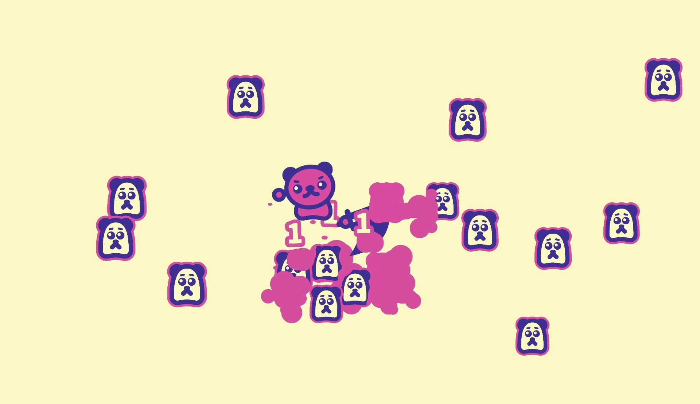

---

### overview
Developed as a yearly project during my first year at Salzburg University of Applied Sciences. I handled the code, art, animation, and playtesting, while the music was composed by my brother, [Sebastian Schweiger](https://www.schweigersebi.com/), and the voice acting was performed by [Saida Feitl](https://www.instagram.com/saidaftl).

### what i did
I built the entire game from scratch in C# using SFML, creating all UI, buttons, animations, scenes, and game objects. I implemented the combo system, enemy logic, and scoring mechanics, and designed all visual assets in Adobe Illustrator.

### results
The game received positive feedback for its gameplay and clean art style, with over 500 leaderboard entries within two weeks.