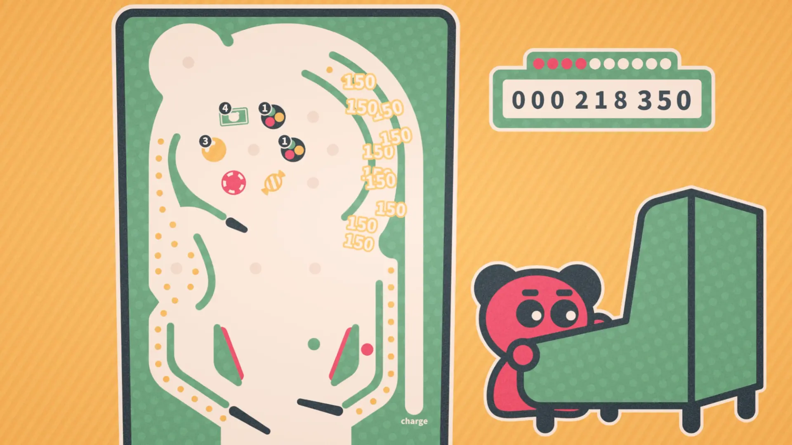
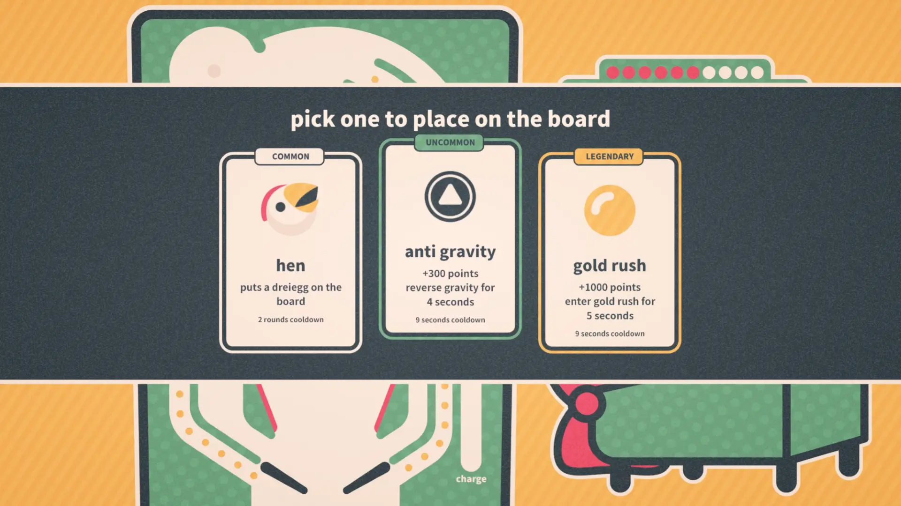
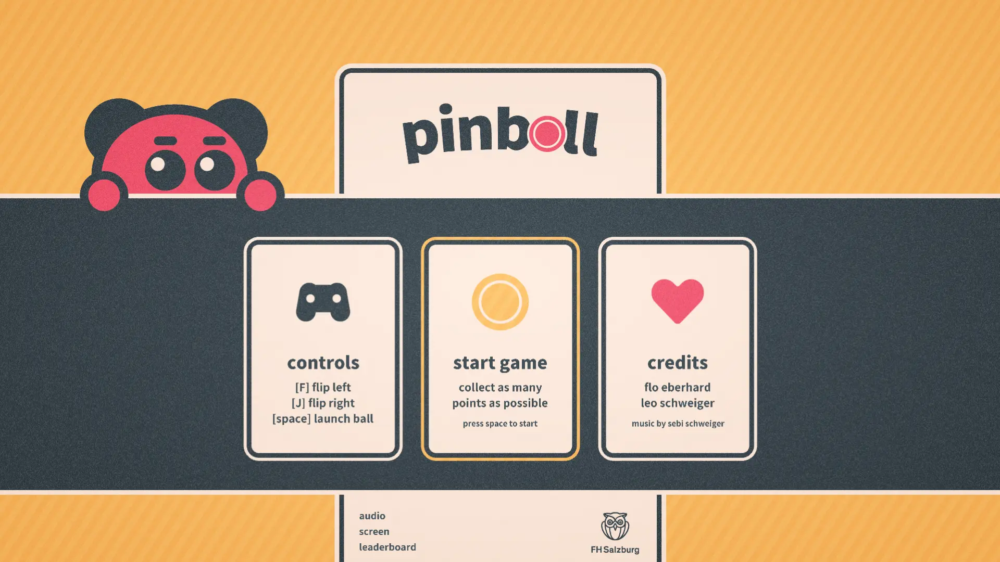

---

### overview
Developed as part of a multimedia project at Salzburg University of Applied Sciences with [Flo Eberhard](https://portfolio.fh-salzburg.ac.at/users/florian-eberhard). The engine, art, sounds, and concept were created by us, while music was provided by [Sebi Schweiger](https://www.schweigersebi.com/).

### what i did
I co-developed the custom engine using SFML and C++, integrating libraries such as Box2D, Tileson, and TGUI. I implemented the pinball physics, power-up system, and overall game structure, and made all art and animation.

### results
The game received positive feedback for its clear concept, responsive physics, and visual polish. Players enjoyed experimenting with different setups and competing on the [online leaderboard](/pinboll).