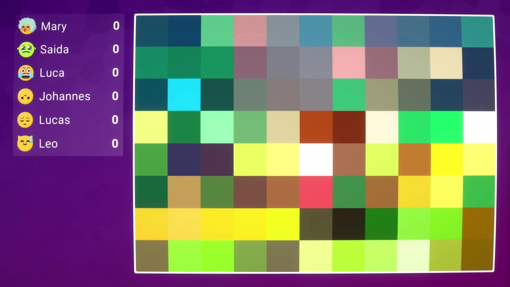
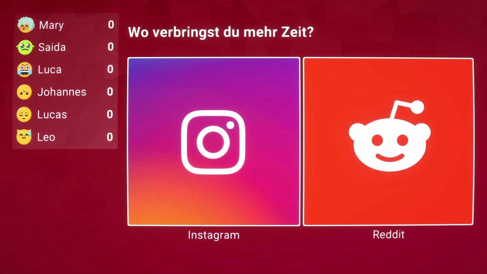
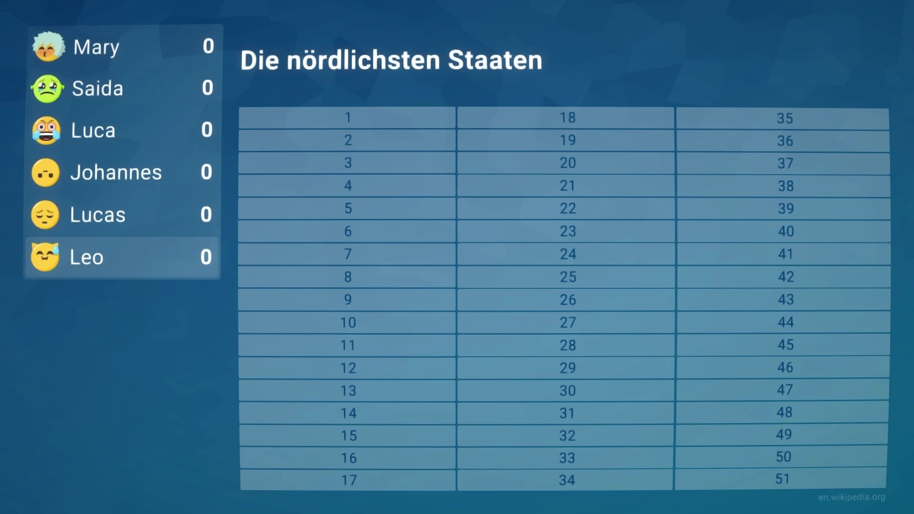

---

### overview
The entire project was developed using Unity, encompassing UI design, game mechanics, animation, sound, and music. Seven events have been hosted to date, with each iteration incorporating improvements. The latest version allows players to participate directly through their browsers on their phone.

### goals
The primary objective was to create an engaging, visually appealing, and user-friendly experience. This project significantly contributed to a deeper understanding of the Unity engine, UI design principles, and overall usability.

### learnings
The project provided valuable insights into networking within Unity, as well as animation and user feedback mechanisms. It involved addressing  challenges such as handling player disconnections and resolving issues in a live environment.

### reception
The game has been well-received by the target audience, with participants consistently expressing enthusiasm and anticipation for future events. Typically, 6 to 10 players take part in each session.
