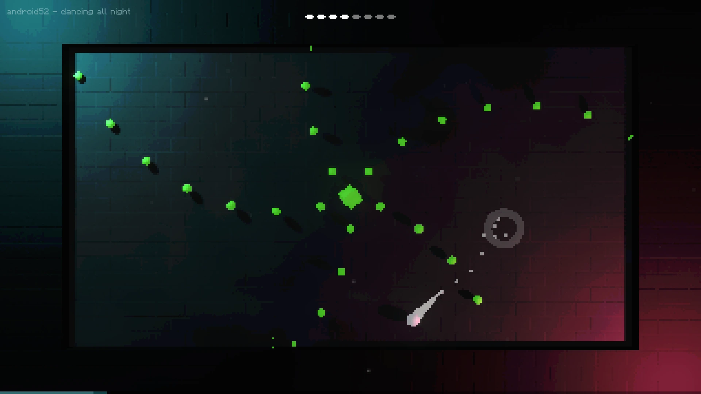
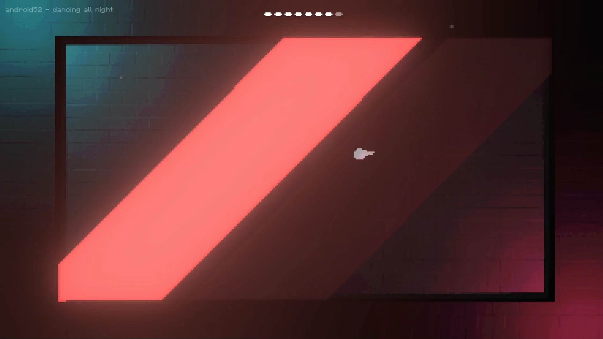
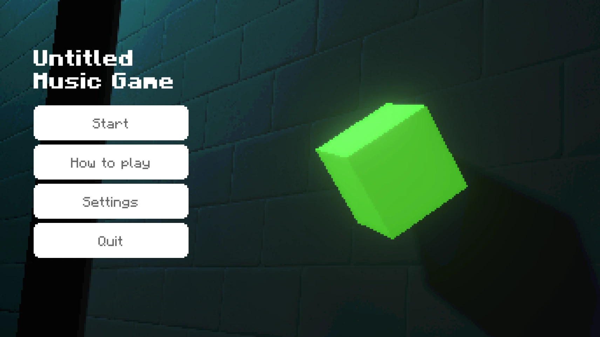

(sound recommended)

---

### overview
Control your character and dodge the rythmic attacks! This project was created in Unity. Everything, the bullet-hell and rhythm systems, the shaders and effects were developed from scratch. The featured song is ["Dancing All Night"](https://www.youtube.com/watch?v=zBKKZQkMHlA) by [android52](https://open.spotify.com/intl-de/artist/3D4WFT29xe0sfSkXNvpmRG).

### goals
I aimed to develop a solid framework for creating a rhythm-based game. While only one level is available, the system is designed to be flexible and expandable. I was also inspired by bullet hell games and wanted to craft fun and engaging attack patterns.

### learnings
As one of my first game projects, I focused on getting the basics right. I learned how to create simple yet satisfying movement, provide feedback to the player through visual and auditory effects, and work with UI.

### reception
Although not publicly available for licensing reasons, a [short clip on Reddit](https://www.reddit.com/r/IndieGaming/comments/tz6vl9/sound_i_made_a_musicbullethellgame_inspired_by/) sparked interest from many players, who offered playtesting and feedback. It was well received, despite being quite difficult to beat at that stage.
